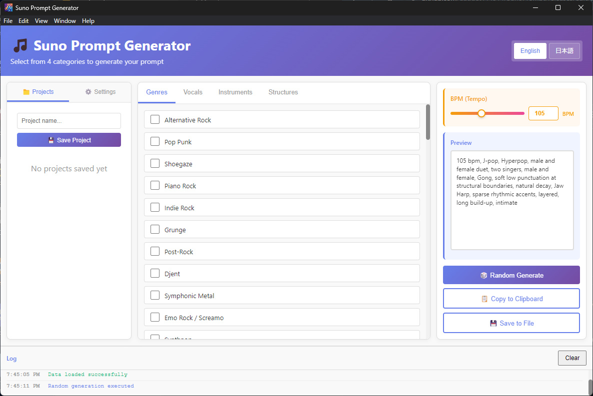

**▶ オンラインで試す: [https://gadget114514.github.io/SunoPrompt/](https://gadget114514.github.io/SunoPrompt/)**

# 🎵 Suno Style Generator

[English](README.md) | 日本語

[Suno AI](https://suno.com/) 用のスタイルプロンプトを、チェックボックスを選ぶだけで組み立てられるデスクトップアプリです。



## 特徴

- **5つのカテゴリから選択** — ジャンル・ボーカル・楽器・コード・構造を組み合わせてプロンプトを生成
- **BPM 指定** — 上部バーのスライダーまたは数値入力でテンポを設定
- **リアルタイムプレビュー** — 選択に合わせてプロンプトが即時更新
- **定位図** — ボーカルと楽器の配置を扇型図で表示。楽器種別のアイコン付きで、カーソルを合わせると名前と定位を表示
- **ランダム生成** — チェックしたカテゴリだけをワンクリックでランダムな組み合わせに
- **カテゴリ単位の再生成** — 各カテゴリの 🎲 でそのカテゴリだけを引き直し、他の選択はそのまま
- **すべてクリア** — 選択とプレビューを一括リセット
- **コピー / 保存** — クリップボードへのコピー、テキストファイルへの保存
- **プロジェクト管理** — 選択内容に名前を付けて保存・読み込み・削除
- **日本語 / English** — UI 言語を切り替え可能

## Web版

インストール不要でブラウザからすぐに使えます: **[https://gadget114514.github.io/SunoPrompt/](https://gadget114514.github.io/SunoPrompt/)**

プロジェクトの保存・読み込みは Windows アプリ版のみの機能です。

## ダウンロード (Windowsアプリ)

[Releases](https://github.com/gadget114514/SunoPrompt/releases) から `SunoPromptGenerator.exe` をダウンロードして実行してください。
インストール不要で、Node.js や npm も必要ありません（Windows x64）。

> 署名なしの実行ファイルのため、初回起動時に Windows SmartScreen の警告が出ることがあります。
> その場合は「詳細情報」→「実行」を選んでください。

## 使い方

1. 中央のタブ（Genres / Vocals / Instruments / Chords / Structures）から項目をチェック
2. 上部バーのスライダーで BPM を調整
3. Preview の見出し横の 📋 でプロンプトをコピー（💾 はファイル保存、🗑️ はすべてクリア）
4. Suno の Style of Music 欄に貼り付け

**🎲 ランダム生成** はチェックの付いたカテゴリをまとめて引き直します。各行の 🎲 なら
そのカテゴリだけを引き直せます。カテゴリは既定ですべてチェック済みです。

**Stage** パネルは下端のリスナーから見た音場を扇型で描きます。ドットの角度が左右の定位、
リスナーからの距離が奥行きです。各マーカーには鍵盤・ギター・ベース・擦弦・金管・木管・打楽器・
民族楽器・電子・アンサンブルといった楽器種別のアイコンが付き、編成を一目で把握できます。
各フォルダ内で楽器やボーカルに定位を設定するとマーカーが移動し、未設定のものは中央に
白抜きのまま残ります。
一点に定まらないものはそのまま描きます。`wide stereo` は横長のバー、`auto-panned` は往復する弧と
その上を動くマーカーで表します。

気に入った組み合わせは左パネルの **Save Project** で保存できます。

## 開発

```bash
git clone https://github.com/gadget114514/SunoPrompt.git
cd SunoPrompt
npm install
npm start
```

### Web版 (GitHub Pages)

`main` へ push すると `.github/workflows/pages.yml` が `src/` と JSON データをまとめて GitHub Pages にデプロイします。
ローカルで確認する場合はリポジトリのルートを配信して `/src/index.html` を開いてください。

```bash
npx http-server . -c-1
```

### exe のビルド

```bash
npm run dist
```

`dist/SunoPromptGenerator.exe`（ポータブル版）が生成されます。

## データファイル

プロンプトの候補は以下の JSON から読み込まれます。編集すれば選択肢をカスタマイズできます。

| ファイル | 内容 |
|---|---|
| `genre.json` | ジャンル |
| `suno_style_vocal_spec.json` | ボーカルのモード・表現 |
| `suno_instrument_techniques.json` | 楽器と奏法 |
| `suno_chord_phrases.json` | コード進行・和声・キー |
| `suno_style_structure_phrases.json` | 曲構成のフレーズ |

## ライセンス

[MIT](LICENSE)
